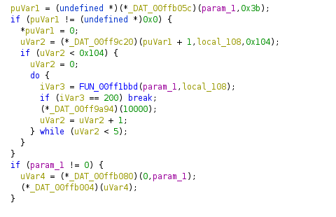
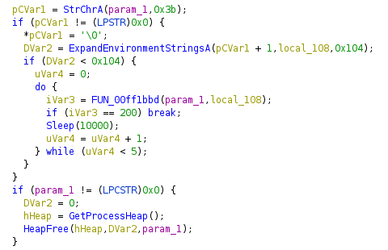

# ApiScout Script

A Ghidra script that parse an output file of [ApiScout](https://github.com/danielplohmann/apiscout) and defines the external functions inside the loaded program. From the ApiScout output file it extract the offset where each function was found as well as its name and the DLL it belongs to. These information will be used to define the external functions within Ghidra in order to better reverse engineer a program.

An example of result:

Before

After

## Installation
Copy the script in folder `$HOME/ghidra_scripts`.

## Usage
Run the script from the _Script Manager_ and provide an ApiScout output file when asked.